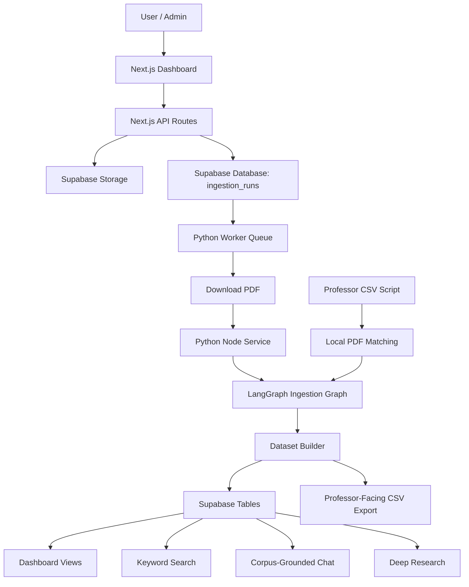
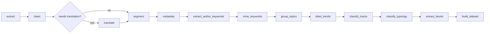
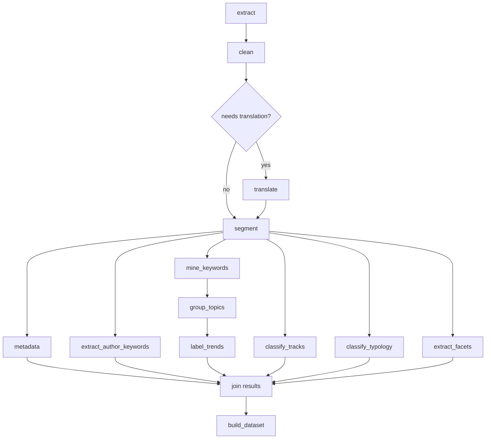
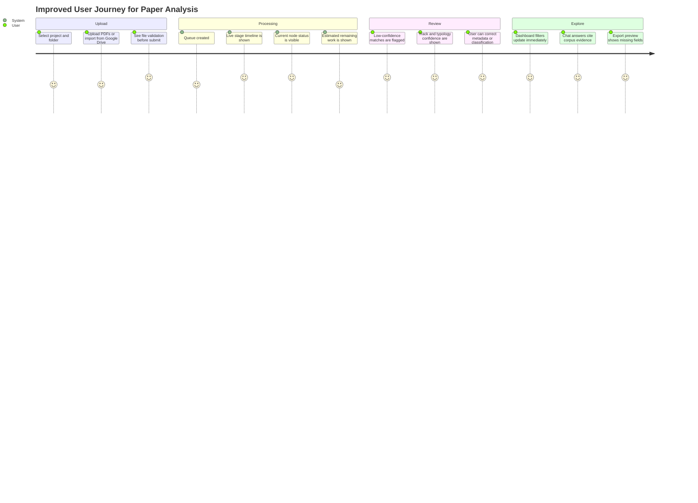
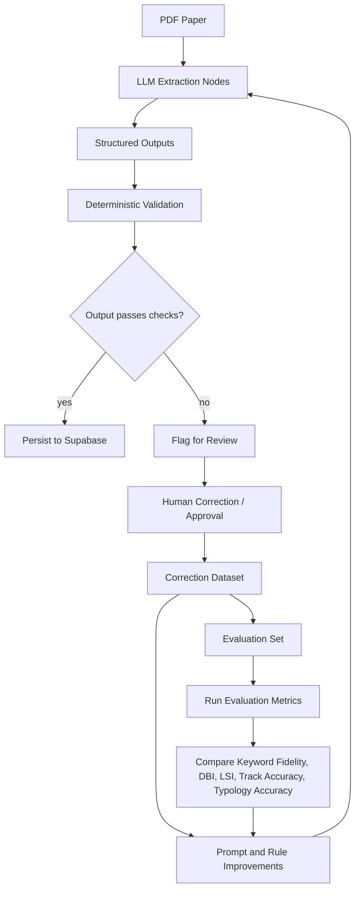
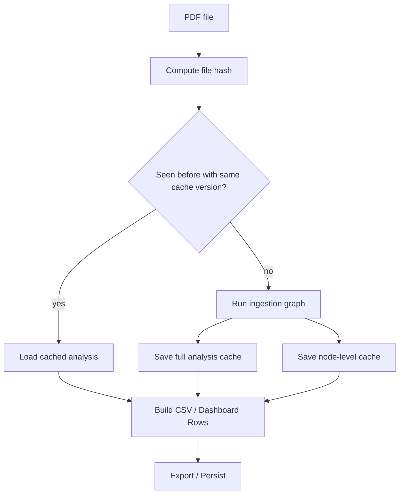
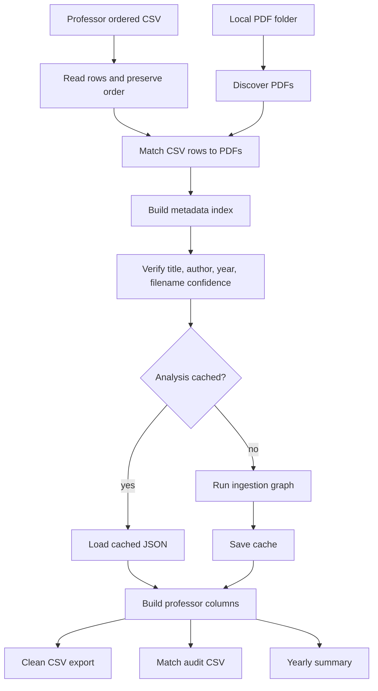
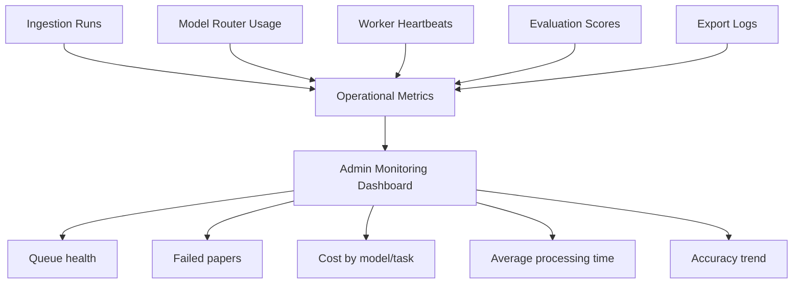

# UX, Efficiency, Accuracy, and Speed Improvement Plan

This document describes diagrams and practical improvements for the EIL Paper Analysis Agent. It is written so the content can be reused in a class report, proposal, or supervisor-facing documentation.

The current project already has a strong modular architecture: a Next.js dashboard, Supabase storage and database, a Python node service, queue workers, LangGraph ingestion, workspace query, deep research flows, and a professor CSV export script. The main opportunity now is to improve the experience around the pipeline: make progress visible, reduce repeated work, increase extraction confidence, and make processing faster.

## 1. Current End-to-End System Flow

The current system can be explained as a multi-layer pipeline. Users upload or import papers, the backend queues processing jobs, Python workers run the LangGraph analysis pipeline, and the dashboard reads normalized outputs from Supabase.

### Explanation

This flow is useful because it separates user interaction from heavy analysis. The dashboard remains responsive while workers process long-running PDF and LLM tasks in the background. The professor CSV script adds another useful path: it can take an ordered professor-provided list, match PDFs to rows, analyze missing papers, cache results, and export one wide CSV.

## 2. Current Ingestion Graph

The current ingestion graph is sequential. It is simple and reliable because each node runs after the previous node finishes.

### Strength

The current graph is easy to debug. If one node fails, it is clear where the failure occurred.

### Limitation

Several nodes do not truly depend on each other. For example, after segmentation, metadata extraction, author keyword extraction, track classification, research typology, and facet extraction can often run independently. Keeping all of them sequential increases total processing time.

## 3. Proposed Faster Ingestion Graph

The main speed improvement is to use a fan-out and join pattern after segmentation. Once the paper has clean segmented text, independent analysis nodes can run in parallel. The dataset builder then waits until all branches complete.

### Expected impact

This change improves speed because the longest LLM calls no longer have to wait for unrelated classification tasks. It also makes the graph more scalable in Cloud Run because parallel branches can use model time more efficiently. The tradeoff is that error handling becomes more important: the join step must know which branches succeeded, which failed, and which outputs can be safely omitted.

## 4. Improved User Experience Flow

The current system is technically strong, but users need clearer feedback while papers are being processed. The user should always know what is happening, what failed, and what can be fixed manually.

### Recommended UX improvements

1. Add a visible processing timeline for each paper.
   - Use the existing ingestion node progress map from `process_ingestion_queue.py`.
   - Show stages such as extracting text, structuring sections, extracting keywords, classifying tracks, classifying typology, and building dataset.

2. Add confidence badges.
   - Show confidence for PDF matching, track classification, typology classification, and author keyword extraction.
   - Example labels: High confidence, Needs review, Missing evidence.

3. Add a review queue.
   - Papers with low match confidence, failed extraction, missing abstract, or ambiguous track classification should appear in a "Needs Review" tab.
   - This prevents silent errors from entering the final professor CSV.

4. Add side-by-side evidence panels.
   - For track and typology classification, show the model output next to quoted evidence from the abstract, introduction, or conclusion.
   - This improves trust and makes supervisor review easier.

5. Add export preview warnings.
   - Before exporting CSV, show missing PDFs, failed analyses, empty author keywords, missing sections, and low-confidence metadata matches.

## 5. Accuracy Improvement Loop

Accuracy should not rely only on better prompts. The system should combine LLM extraction, deterministic validation, human review, and evaluation metrics.

### Recommended accuracy improvements

1. Add validation gates after each important node.
   - Metadata: title must not be empty, year must be plausible, author field should not contain section text.
   - Author keywords: return rows only when explicit keyword labels are found.
   - Track classification: require a primary track plus evidence.
   - Research typology: require primary group, optional secondary group, and boundary-rule explanation.
   - Dataset builder: reject impossible rows, duplicate IDs, and empty required fields.

2. Store evidence snippets.
   - Each classification should store short evidence from the paper.
   - This helps humans verify the result and helps future evaluation.

3. Add a human-labeled gold set.
   - Start with 20 to 30 papers.
   - Label track, typology, author keywords, abstract, methodology, and major topic.
   - Use this as a stable benchmark whenever prompts or model routing change.

4. Add regression evaluation.
   - Do not only evaluate the latest output.
   - Compare new runs against prior scores to detect prompt changes that improve one metric but hurt another.

5. Separate author keywords from generated keywords.
   - Author keywords represent author intent.
   - Generated keywords represent model inference.
   - Mixing them reduces interpretability and makes trend analysis less reliable.

## 6. Efficiency and Caching Design

Efficiency improves when the system avoids redoing expensive work. The new professor CSV script already uses caching, but the same idea can be pushed further into node-level caching and dashboard processing.

### Recommended efficiency improvements

1. Use node-level cache keys.
   - Cache by PDF hash, node name, prompt version, model preset, and schema version.
   - If only the typology prompt changes, the system should not need to rerun PDF extraction, segmentation, or keyword mining.

2. Add resumable runs.
   - If a paper fails at `classify_typology`, resume from that node instead of restarting from PDF extraction.

3. Deduplicate uploads.
   - Check file hash before creating a new queue job.
   - If the same PDF already exists, link it to the new folder/project instead of reprocessing.

4. Use batch-aware rate limiting.
   - Limit concurrent LLM calls based on provider limits.
   - Keep lightweight tasks on cheaper models and difficult structured tasks on stronger models.

5. Separate local professor export cache from production cache.
   - Local export can be aggressive and file-based.
   - Production should use database-backed cache metadata so workers can share results.

## 7. Speed Improvement Architecture

Speed can be improved at three levels: graph level, worker level, and deployment level.

```mermaid
flowchart LR
    subgraph Graph["Graph-Level Speed"]
        A1["Parallel independent nodes"]
        A2["Skip translation when not needed"]
        A3["Resume failed node only"]
    end

    subgraph Worker["Worker-Level Speed"]
        B1["Process multiple queued runs"]
        B2["Heartbeat and stale recovery"]
        B3["Avoid duplicate PDFs"]
    end

    subgraph Model["Model-Level Speed"]
        C1["Task-specific model routing"]
        C2["Timeout and fallback"]
        C3["Cheaper model for simple tasks"]
    end

    subgraph Deploy["Deployment-Level Speed"]
        D1["Cloud Run in asia-southeast1"]
        D2["Min instances for warm service"]
        D3["Scheduler triggers small batches"]
    end

    Graph --> Worker --> Model --> Deploy
```

### Recommended speed improvements

1. Parallelize after segmentation.
   - Metadata, author keywords, track classification, typology, and facets can run independently.

2. Keep task-specific model routing.
   - The current `nodes/model_router.py` already routes cheaper tasks to lighter models and harder tasks to stronger models.
   - Keep this pattern and evaluate cost versus quality.

3. Add timeout-specific retry behavior.
   - If a strong model times out, retry once with fallback.
   - If the fallback also fails, store partial outputs and mark the paper as review-needed.

4. Use small queue batches in Cloud Run.
   - Small batches reduce the chance of long stuck workers.
   - Cloud Scheduler can trigger repeated small batches.

5. Add progress streaming or polling.
   - The UI should poll processing status and show node-level progress.
   - This does not make the pipeline faster, but it makes the perceived speed much better.

## 8. Professor CSV Export Flow

The new `scripts/build_professor_csv.py` script is important because it supports a professor-facing workflow. It treats an ordered input CSV as the source of truth, discovers local PDFs, matches them to rows, analyzes papers, caches results, and exports a clean wide CSV.

### Recommended CSV export improvements

1. Add an HTML or dashboard preview before final CSV export.
   - Professors can inspect missing fields and low-confidence matches before receiving the final file.

2. Add a correction file.
   - If a PDF is matched incorrectly, store the correction in a small CSV or database table.
   - Future exports should reuse manual corrections.

3. Add export quality score.
   - Example: 92 percent complete, 8 papers need review, 3 missing methodology sections.

4. Keep audit columns.
   - Do not remove match confidence, matched PDF path, analysis status, or analysis error from internal audit outputs.
   - They are crucial for debugging.

## 9. Observability Dashboard

The system should have an internal monitoring page for operators. This is different from the academic dashboard. It helps the developer see whether the pipeline is healthy.

### Metrics to show

| Metric | Why it matters |
|---|---|
| Number of queued, processing, succeeded, and failed runs | Shows whether the pipeline is stuck |
| Average processing time per paper | Measures speed |
| Average processing time per node | Identifies bottlenecks |
| Model usage and estimated cost by task | Controls cost and supports model routing decisions |
| Failure rate by node | Shows where prompts or parsers need improvement |
| Papers needing review | Improves data quality before export |
| Keyword Fidelity, DBI, and LSI over time | Tracks evaluation quality |
| Track and typology agreement with human labels | Measures classification accuracy |

## 10. Prioritized Roadmap

The improvements should be implemented in stages. The first stage should focus on visibility and correctness because these reduce confusion immediately. The second stage should focus on speed and automation.

| Priority | Improvement | Main benefit | Estimated effort |
|---|---|---|---|
| P0 | Show node-level progress in the UI | Better UX and user trust | Low |
| P0 | Add review-needed status for failed or low-confidence papers | Better accuracy | Low |
| P0 | Add export preview warnings | Better professor-facing output | Low |
| P1 | Add evidence snippets for track and typology | Better explainability | Medium |
| P1 | Add node-level validation gates | Better accuracy | Medium |
| P1 | Add manual correction persistence | Better long-term data quality | Medium |
| P2 | Parallelize independent graph branches | Faster processing | Medium to high |
| P2 | Add node-level cache and resumable runs | Better efficiency | Medium to high |
| P2 | Add operational monitoring dashboard | Better reliability | Medium |
| P3 | Build human-labeled evaluation benchmark | Better accuracy measurement | High |
| P3 | Add full end-to-end tests for upload to dashboard | Better production safety | High |

## 11. Report-Ready Summary

To improve the user experience, the system should make the analysis pipeline visible to users through node-level progress, confidence labels, review queues, and export previews. This is especially important because academic users need to trust the outputs before using them in research reports or supervisor-facing CSV files.

To improve efficiency, the system should avoid repeated work through file-hash deduplication, node-level caching, and resumable runs. The professor CSV script already demonstrates the value of caching, and this idea can be expanded into the production ingestion pipeline.

To improve accuracy, the system should combine LLM extraction with deterministic validation, evidence snippets, human review, and regression evaluation. Author-provided keywords should remain separate from generated keywords, and research typology should remain separate from track classification because these fields answer different analytical questions.

To improve speed, the ingestion graph should eventually use parallel branches after segmentation. Metadata extraction, author keyword extraction, track classification, typology classification, and facet extraction can run independently once clean sections are available. This would reduce total processing time while preserving the modular LangGraph design.

Overall, the next version of the project should be designed around four goals: make progress visible, make outputs reviewable, make repeated runs cheaper, and make independent LLM tasks parallel.
