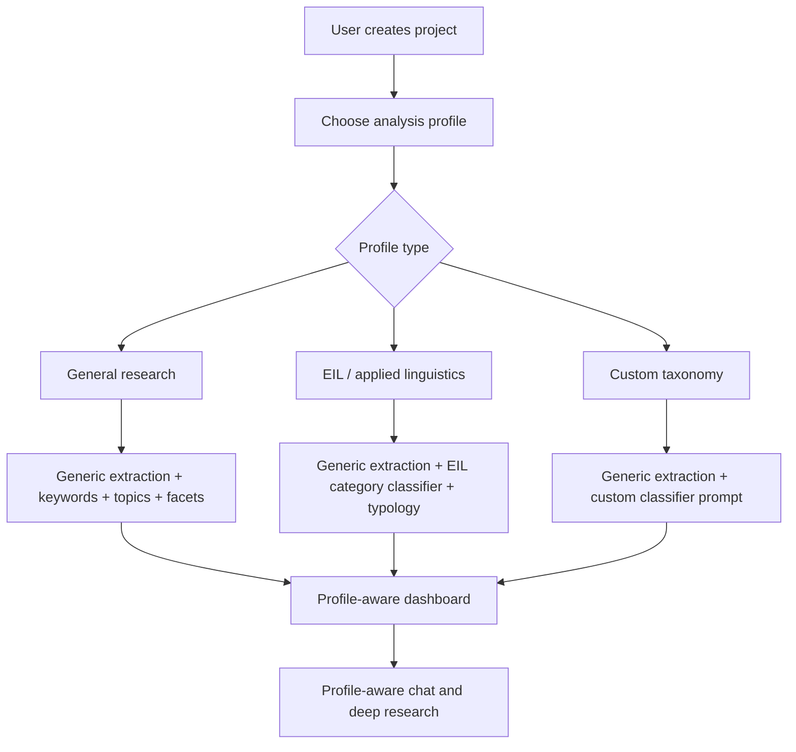

# Chula-Wide Generalization Plan

Generated: 2026-08-18

## Problem

The current system began as an EIL research analysis tool. That is appropriate for the original project, but it creates a product risk if Papertrend is opened to users across Chulalongkorn University.

For a university-wide audience, the UI and model behavior should not imply that every paper belongs to the EIL taxonomy:

- EL: English Linguistics
- ELI: English Language Instruction
- LAE: Language Assessment & Evaluation
- Other

This is especially important because users from other faculties may upload papers from medicine, engineering, business, social science, science, law, architecture, or interdisciplinary programs. If the system forces those papers into EL/ELI/LAE, the dashboard will look polished but academically wrong.

## Current State

The system already has many general-purpose pieces:

- PDF extraction.
- Text cleaning.
- Section segmentation.
- Metadata extraction.
- Author-provided keyword extraction.
- Generated keyword extraction.
- Topic grouping and topic labeling.
- Research facet extraction.
- Paper library.
- Dashboard.
- Repository chat.
- Deep research.

The main EIL-specific pieces are:

- `prompts/track_classifier.txt`
- `state.py` track schema
- `nodes/common.py` track field map
- `workspace_data.py` track constants
- Dashboard and chat references to research tracks
- Database tables/views using `el`, `eli`, `lae`, and `other` columns

The research typology node is more reusable than the EIL track node, but it was still originally worded for language and education research. It should be presented as a configurable research typology, not as a universal truth for every discipline.

## Immediate Changes Already Made

The public-facing wording has been softened from EIL-specific “tracks” to more general “categories” in the main product copy and onboarding-style surfaces.

The workspace settings UI now lets users define:

- Research domain
- Additional analysis context
- Taxonomy name
- Up to three project categories with descriptions

Direct PDF uploads and Google Drive queue creation now save a sanitized snapshot of those settings into:

```text
ingestion_runs.input_payload.analysis_profile
```

The Python pipeline reads that snapshot in the keyword extraction, facet extraction, category classification, and research typology prompts.

For compatibility with the existing database, the first three user categories currently map to the old internal storage slots:

```text
EL  -> Category 1
ELI -> Category 2
LAE -> Category 3
```

Those slot names should be treated as implementation details until the generic category tables are added.

The category classifier prompt now includes a guardrail:

- It describes EL/ELI/LAE as internal storage slots, not as universal categories.
- It tells the model to use the user-defined project categories and additional context.
- It uses `Other` when no configured category genuinely matches the paper.

The typology classifier prompt now describes itself as an academic-paper typology classifier and asks the model to note disciplinary mismatch or low confidence when the paper does not naturally fit the language/education-oriented typology.

These changes reduce the most harmful failure mode, but the product still needs generic category tables before it becomes fully taxonomy-agnostic at the database level.

## Recommended Product Direction

Papertrend should become profile-based.

A workspace or project should have an analysis profile such as:

- General research profile
- EIL / applied linguistics profile
- Faculty of Education profile
- Faculty of Arts profile
- Faculty of Engineering profile
- Faculty of Medicine profile
- Custom taxonomy profile

Each profile should define:

- Display name
- Domain description
- Category labels
- Category definitions
- Classifier prompt
- Whether category classification is enabled
- Whether research typology is enabled
- Which dashboard tabs should appear
- Which chat tools should mention category classification

## Recommended Architecture



## Data Model Migration

The current track storage is column-based:

```text
paper_tracks_single: el, eli, lae, other
paper_tracks_multi: el, eli, lae, other
```

This is not flexible enough for all Chula users.

Recommended replacement:

```text
analysis_taxonomies
- id
- owner_user_id
- project_id
- profile_key
- name
- description
- created_at

analysis_categories
- id
- taxonomy_id
- key
- label
- description
- color
- sort_order

paper_category_assignments
- id
- paper_id
- taxonomy_id
- category_id
- assignment_type
- confidence
- rationale
- evidence
- created_at
```

Compatibility path:

- Keep the old `paper_tracks_single` and `paper_tracks_multi` views for the current dashboard.
- Add new taxonomy tables beside them.
- Write new category assignments for new runs.
- Backfill EL/ELI/LAE into the generic category table.
- Update dashboard components to read dynamic category definitions.
- Remove hardcoded EL/ELI/LAE only after dashboards and exports are migrated.

## Prompt Migration

Current:

```text
track_classifier.txt
```

Recommended:

```text
category_classifier_base.txt
category_profiles/eil_applied_linguistics.txt
category_profiles/general_research.txt
category_profiles/custom_template.txt
```

The runtime should build the classifier prompt from the selected project profile.

Prompt builder inputs:

- Project domain
- Category definitions
- Boundary rules
- Paper title
- Abstract/claims
- Methods
- Results
- Conclusion
- Extracted concepts

## UX Changes

The setup flow should ask users what kind of repository they are creating.

Recommended setup question:

```text
What kind of research collection is this?
```

Options:

- General research collection
- Applied linguistics / language education
- Custom categories

If the user chooses general research:

- Do not show EL/ELI/LAE labels.
- Use neutral dashboard language: categories, themes, topics, years, methods.
- Keep category classification optional.
- Prefer keyword/topic/facet views over track views.

If the user chooses EIL/applied linguistics:

- Show EL/ELI/LAE labels.
- Enable the EIL category classifier.
- Show category-specific dashboards.

If the user chooses custom categories:

- Ask for category names and descriptions.
- Generate a classifier prompt draft.
- Let the user review before running the analysis.

## Model Behavior Rules

For all-Chula deployment:

- Never assume the corpus is EIL.
- Never force a paper into EL/ELI/LAE unless the selected profile is EIL/applied linguistics.
- Always show when a classification is profile-specific.
- Preserve `Other` or `Unclassified` as a valid, respectable result.
- Prefer evidence-grounded uncertainty over fake precision.
- Let users disable category classification for exploratory repositories.

## Dashboard Behavior Rules

Dashboard labels should be profile-aware:

- Generic profile: `Categories`
- EIL profile: `Tracks`
- Custom profile: the user-defined taxonomy name

Charts should also be profile-aware:

- Do not show track charts when the active profile has no track taxonomy.
- Do show topic, keyword, year, method, author keyword, and typology views when available.
- Drilldowns should work from both generic categories and EIL tracks.

## Recommended Implementation Phases

## Phase 1 - Safe Copy, Prompt Guardrails, and Profile Snapshot

Status: implemented as a compatibility layer.

Actions:

- Replace public EIL/track wording with neutral category wording.
- Add prompt guardrails so non-EIL papers are not forced into EIL classes.
- Add user inputs for project categories and additional context.
- Save a sanitized analysis profile snapshot when files are queued.
- Read the analysis profile in model prompts.
- Keep old database shape for compatibility.

## Phase 2 - Workspace Analysis Profile

Add project-level profile settings:

- `analysis_profile_key`
- `taxonomy_name`
- `category_mode`
- `typology_mode`

Start with two profiles:

- `general_research`
- `eil_applied_linguistics`

## Phase 3 - Generic Category Storage

Add generic taxonomy/category tables.

Write both:

- new generic `paper_category_assignments`
- old compatibility `paper_tracks_single` and `paper_tracks_multi`

## Phase 4 - Dynamic Dashboard

Update dashboard, chat, and paper explorer to consume dynamic taxonomy metadata.

Replace hardcoded constants:

- `TRACK_COLS`
- `TRACK_NAMES`
- `TRACK_COLORS`

with project profile category metadata.

## Phase 5 - Custom Taxonomy Builder

Let users create categories inside a project.

The app should generate a draft prompt, but the user should approve it before large batch analysis.

## Recommendation Before Public Chula Launch

Do not market the system as an EIL-only agent if the intended audience is all Chula users.

Use this positioning instead:

```text
Papertrend is a research intelligence workspace for turning paper collections into searchable evidence, topics, trends, and grounded chat. Program-specific taxonomies, such as EIL tracks, can be enabled per project.
```

This keeps the original EIL strength while avoiding misleading outputs for other faculties.
