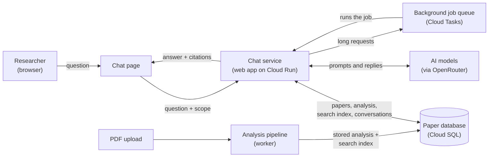
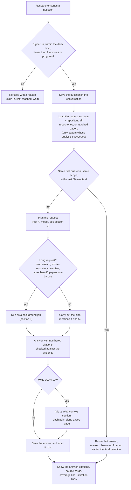
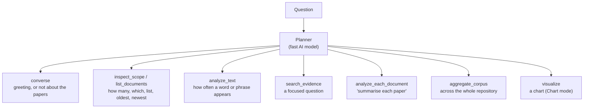
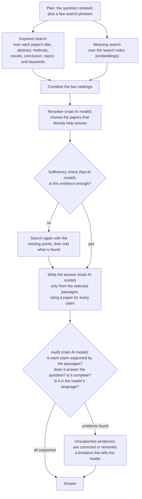
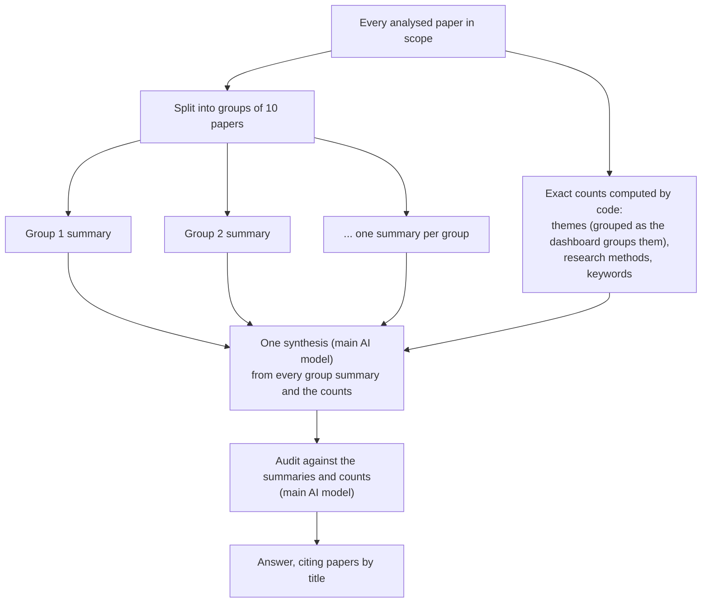
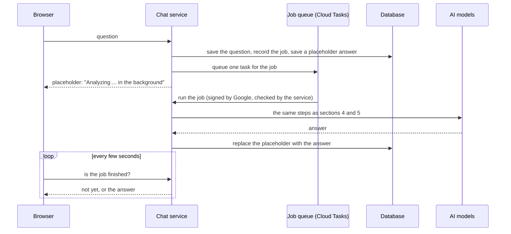
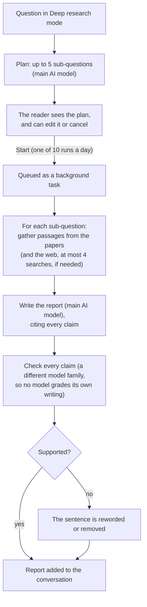

# How Papertrend's chat works

Chat answers questions about the papers in a repository, and says which paper each claim comes from. It does not answer from general knowledge: every answer about the repository is built from the papers' stored analysis and text, then checked against them.

This page describes the chat as it runs in production (October 2026). The flowcharts are written in Mermaid, which GitHub and most Markdown viewers draw as diagrams.

Contents:

1. [The big picture](#1-the-big-picture)
2. [One question, step by step](#2-one-question-step-by-step)
3. [What the planner can choose](#3-what-the-planner-can-choose)
4. [A focused question](#4-a-focused-question)
5. [A question about the whole repository](#5-a-question-about-the-whole-repository)
6. [Background jobs](#6-background-jobs)
7. [Deep research](#7-deep-research)
8. [Which AI model does what](#8-which-ai-model-does-what)
9. [Safeguards](#9-safeguards)
10. [Where it lives in the code](#10-where-it-lives-in-the-code)

---

## 1. The big picture

Chat never reads a PDF directly. When a paper is uploaded, the **analysis pipeline** extracts its text and stores a structured analysis: title, year, abstract, methods, results, conclusion, topics, keywords and categories. It also builds a **search index**: each paper is split into passages, and each passage gets an *embedding*, a list of numbers that captures its meaning so passages can be found by meaning rather than by exact words. Chat works from that stored data.

---

## 2. One question, step by step

While it works, the page names each step as it happens ("Opening your repository", "Searching your papers", "Checking it against the evidence", "Formatting citations"), and the answer appears as soon as it has been checked.

---

## 3. What the planner can choose

The first model call reads the question and returns a small, structured **plan**: which operations to run (up to four), whether the question needs every paper or only the most relevant ones, the search phrases to use, and the language and format of the answer. If the planner's reply cannot be read, simple keyword rules choose the operation instead.

| Operation | How it is answered | AI model involved |
| --- | --- | --- |
| **converse** | A short reply, marked "Repository context not used". | Yes, briefly |
| **inspect_scope**, **list_documents** | Counted and listed exactly from the stored analysis; every paper involved is cited. | No |
| **analyze_text** | Word and phrase counts computed from the stored text. | No |
| **search_evidence** | The most relevant passages are found, an answer is written from them, then checked (section 4). | Yes |
| **analyze_each_document** | One short analysis per paper, in groups. | Yes |
| **aggregate_corpus** | One overview written from every paper in scope, with exact counts (section 5). | Yes |
| **visualize** | A chart from the same themes, methods, categories and years as the dashboard. An AI model only picks which view fits the question; the numbers, title and caption are computed by code. | Yes, briefly |

Questions the papers cannot answer, such as citation counts, h-index or impact factor, are refused with a pointer to Scopus, Web of Science or Google Scholar: the repository holds the papers' text, not bibliographic records.

---

## 4. A focused question

Most questions ("What do the papers find about peer feedback?") take this path.

Notes:

- **Two searches at once.** Keyword search finds exact terms, and meaning search finds passages that say the same thing in other words. Running both and combining them catches papers either one alone would miss.
- **The paper text is treated as data, not instructions.** The models are told never to follow instructions that appear inside a paper.
- **The answer says how much it covers**, for example "Based on 6 of 38 papers". A focused answer reports the relevant evidence; it is not a reading of every paper.

---

## 5. A question about the whole repository

Questions such as "Summarise the main findings across all the papers" or "Which topics come up most often?" need every paper, which is too much text for one model call. The work is split, then combined (a *map-reduce* pattern).

- Each group summary reads, for every paper: title, year, topics, the first 1,500 characters of the abstract, and the methods, results and conclusion.
- Any "how many" or "most often" in the answer comes from the counts, never from a model's estimate, so chat and the dashboard agree.
- These answers run as background jobs (section 6), because they take one to two minutes.

---

## 6. Background jobs

Some requests take longer than a web request may stay open: web search, a whole-repository overview, analysing each of more than 80 papers one by one, or a plan that combines several heavy steps. These run as background jobs.

- The reader can leave the page; the answer stays attached to the conversation.
- A job that fails for a temporary reason is tried again, at most twice; then the conversation says plainly that it failed, and nothing partial is shown.
- Only Google's task service, with a token Google signed for this service, can start a job.

---

## 7. Deep research

Deep research is a separate mode for questions that need a longer, structured investigation. It runs on the papers in scope, and on the web only where the papers cannot answer.

Progress is shown step by step while it runs. If a step fails, a retry continues from where it stopped and is not charged again.

---

## 8. Which AI model does what

All models are reached through OpenRouter.

| Step | Model | Why |
| --- | --- | --- |
| Writing the answer | **GPT-5.6 Luna** by default; the reader can choose **Gemini 3.7 Flash** | The step the reader reads |
| Choosing the evidence (reranker) | The reader's model | Decides what the answer is built from; the fast model returned every paper instead of choosing |
| Checking the answer (audit) | The reader's model | Measured: the fast model cost about 2.5 times as much here and was not faster |
| Planning, and judging whether the evidence is enough | **Gemini 3.7 Flash** | Short structured replies, read only by code |
| Chart: choosing the view | **Gemini 3.1 Flash-Lite** | A small choice from a fixed menu; code draws the chart |
| Meaning search | **text-embedding-3-small** | Turns passages and questions into embeddings |
| Deep research: plan, gather, write, revise | **GPT-5.6 Luna** | Long reading and writing |
| Deep research: claim check | **Gemini 3.7 Flash** | A different model family from the writer |

---

## 9. Safeguards

- **Only your own papers.** Who is asking comes from the verified sign-in, never from what the browser sends. The database also refuses rows that belong to someone else in the search index, chat jobs and other shared tables.
- **Every claim is cited, then checked.** An answer that cannot be checked says so in a limitation line.
- **Paper text is data.** Instructions hidden in a paper are not followed.
- **Spending is bounded.** Each person has a daily limit of 1,000,000 tokens and 10 deep research runs; the site and each person also have a daily dollar limit; and one person can have at most two answers in progress. A limit that cannot be checked refuses the request rather than letting it through.
- **Repeated questions are cheap.** The same first question in the same scope within 30 minutes reuses the earlier answer, and says so.

---

## 10. Where it lives in the code

For developers. Paths are relative to `eil-dashboard/`.

| Part | File |
| --- | --- |
| Chat page | `src/components/chat/ChatClient.tsx` |
| Chat request (sign-in, limits, streaming, saving) | `src/app/api/chat/route.ts` |
| Planning, searching, writing and checking | `src/lib/repository-chat.ts` |
| Which steps use the fast model | `src/lib/model-routing.ts` |
| When a request becomes a background job | `src/lib/repository-chat-routing.ts` |
| Background jobs | `src/lib/repository-chat-jobs.ts`, `src/app/api/chat/jobs/process/route.ts` |
| Web search step | `src/lib/repository-chat-web.ts` |
| Chart step | `src/lib/chat-chart.ts` |
| Deep research | `src/lib/deep-research/`, `src/app/api/chat/research/process/route.ts` |
| Default model per task | `src/lib/server-env.ts` |
| The analysis pipeline that fills the database | `eil-dashboard/worker/` and `nodes/` (Python) |
